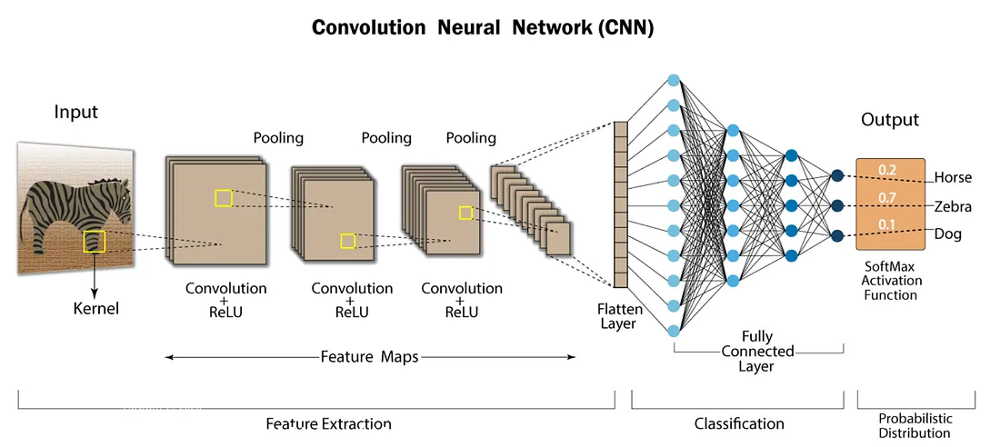
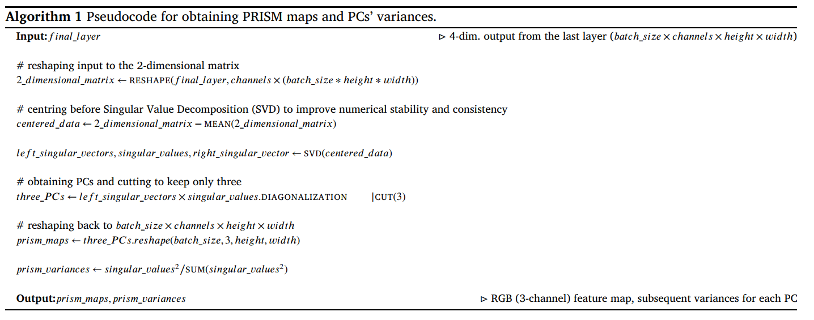
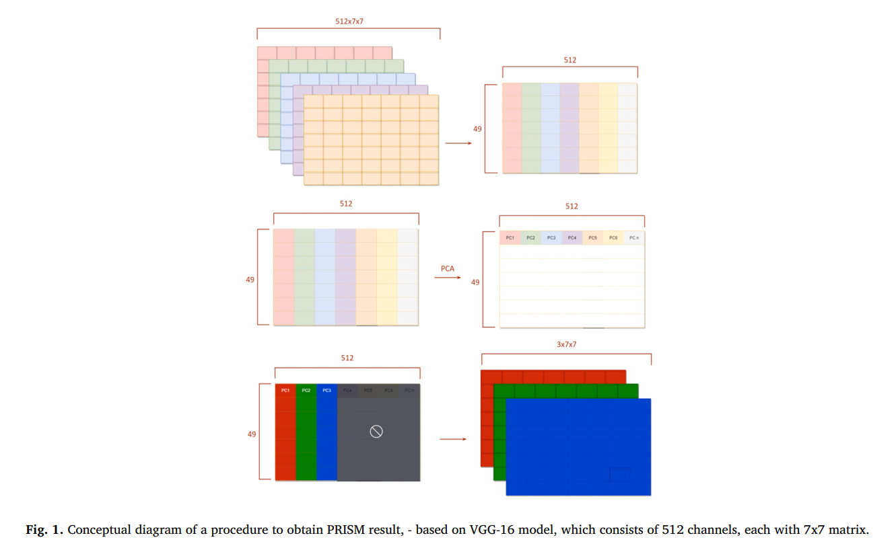
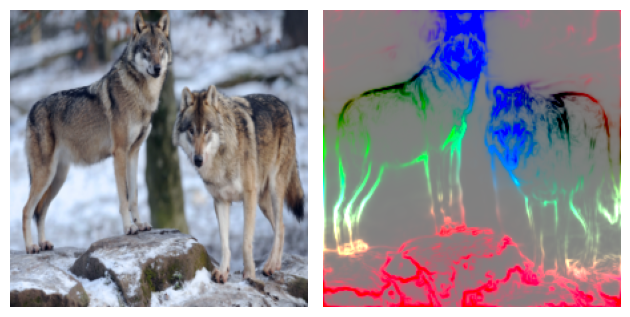
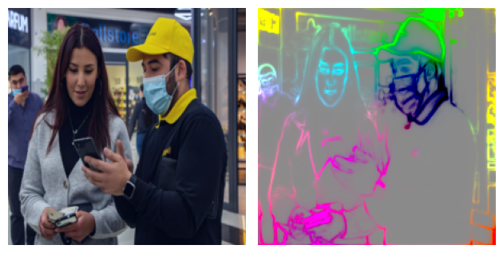
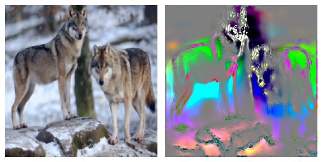
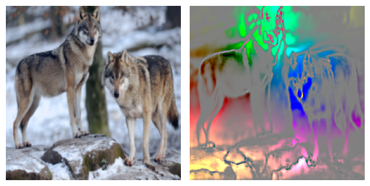

# TorchPRISM

**Table of Contents**

- [TorchPRISM](#torchprism)
  - [Introduction: Unlocking CNNs with PRISM](#introduction-unlocking-cnns-with-prism)
  - [Understanding CNNs](#understanding-cnns)
  - [Introducing PRISM: A Glimpse into CNN Decision-Making](#introducing-prism-a-glimpse-into-cnn-decision-making)
  - [Implementation of PRISM](#implementation-of-prism)
  - [How to use](#how-to-use)
  - [Examples](#examples)
    - [VGG11](#vgg11)
    - [ResNet101](#resnet101)
    - [GoogleNet](#googlenet)

## Introduction: Unlocking CNNs with PRISM

Convolutional Neural Networks (CNNs) have revolutionized computer vision, powering innovations from facial recognition to autonomous vehicles. Yet, their decision-making process remains a mystery, hindering trust and understanding.

Inspired by the paper "Unlocking the black box of CNNs: Visualising the decision-making process with PRISM," our blog sets out to demystify CNNs' decisions.

In this short intro, we'll touch on CNN basics, the need for transparency, and introduce PRISM as our tool of choice for visualizing CNN decisions. Get ready to see CNNs in a new light!

## Understanding CNNs

CNNs are the backbone of modern computer vision, mimicking the human visual system to recognize patterns and features in images. At their core, CNNs consist of layers of neurons organized in a hierarchical fashion, each layer extracting increasingly complex features from the input data.

**Why Interpretability Matters:** While CNNs excel at tasks like image classification and object detection, their inner workings often remain inscrutable. This lack of transparency raises concerns about bias, fairness, and reliability in AI systems. Understanding how CNNs arrive at their decisions is crucial for ensuring accountability and trust.

**Visualizing CNNs:** Techniques like PRISM offer a window into CNN decision-making. By visualizing the activations of individual neurons and feature maps across different layers of the network, PRISM helps unravel the thought process behind CNN predictions.



## Introducing PRISM: A Glimpse into CNN Decision-Making

**Meet PRISM:** Predictive, Interactive, Summarisation, and Modelling. PRISM isn't just a tool; it's a key to unlocking the black box of CNN decision-making.

**Predictive:** PRISM enables us to predict and understand how CNNs arrive at their decisions by visualizing the activation patterns within the network.

**Interactive:** With PRISM, exploring CNN decision-making is not a passive experience. It's an interactive journey where we can manipulate inputs, observe neuron activations, and gain insights into the network's inner workings.

**Summarisation:** PRISM doesn't overwhelm us with complex data. Instead, it distills the essence of CNN decision-making into intuitive visualizations that highlight the most influential features and neurons.

**Modelling:** Through PRISM, we model and interpret the decision-making process of CNNs, shedding light on their behavior and paving the way for more transparent and accountable AI systems.

## Implementation of PRISM

Implementing PRISM brings us closer to understanding the intricate decision-making processes of Convolutional Neural Networks (CNNs). Let's explore how to harness the power of PRISM to visualize CNN activations and gain valuable insights.

**Step 1: Data Preparation:**
Prepare the input data and the trained CNN model you want to analyze. Ensure that the data is in a format compatible with your chosen deep learning framework.

```python
# crop image for the model input
_crop = transforms.Compose([
    transforms.ToPILImage(),
    transforms.Resize((224, 224))
])

# normalize image for model input on which it was trained
_normalize = transforms.Compose([
    transforms.ToTensor(),
    transforms.Normalize([0.485, 0.456, 0.406], [0.229, 0.224, 0.225])
])
```

If you have different data preprocessing steps add them here.

**Step 2: Model Loading:**
Load the pre-trained CNN model into your preferred deep learning framework, such as PyTorch. This model will serve as the basis for visualizing activations with PRISM.

```python
model_name = 'vgg11'
model = models.get_model(model_name, weights=True)
```

**Step 3: PRISM:**

The proposed technique uses PCA of features detected by neural network models to create an RGB coloured image mask that highlights the features identified by the model. PRISM can be used for better human interpretation of neural network representations and to automate the identification of ambiguous class features. The combination of PRISM with another method, Gradual Extrapolation, results in an image showing each segment of a classified object in different colours. PRISM can help identify indistinct classes and improve the real-world application of the model.

Generating PRISM results consists of simple matrix manipulation and computation of the PCA (Fig. 1). First, we transform the output from the chosen layer of the model into a two-dimensional matrix. Each channel becomes a single column in the resulting matrix. In this matrix, we computed the PCA and cut off all PCs beyond the first three. In the last step, we transform these three PCs back into channel matrices to assign later colours red, green, and blue to make them visually distinguishable.





**Step 4: PRISM Implementation:**

Get top three PC's for RGB color.

```python
def _get_pc(self, final_excitation):

    final_layer_input = final_excitation.permute(0, 2, 3, 1).reshape(
        -1, final_excitation.shape[1]
    )
    normalized_final_layer_input = final_layer_input - final_layer_input.mean(0)

    u, s, v = normalized_final_layer_input.svd(compute_uv=True)
    self._variances = s**2/sum(s**2) # save the variance
    raw_features = u[:, :3].matmul(s[:3].diag())

    return raw_features.view(
        final_excitation.shape[0],
        final_excitation.shape[2],
        final_excitation.shape[3],
        3
    ).permute(0, 3, 1, 2)
```

Use PC to perform PRISM.

```python
def prism(self, grad_extrap=True):
    if not self._excitations:
        print("No data in hooks. Have You used `register_hooks(model)` method?")
        return

    with torch.no_grad():
        rgb_features_map = self._get_pc(self._excitations.pop())

        if grad_extrap:
            rgb_features_map = self._upsampling(
                rgb_features_map, self._excitations
            )
        rgb_features_map = self._normalize_to_rgb(rgb_features_map)

    return rgb_features_map
```


Basic PRISM outputs RGB image according to last layer. To get accurate output we do  upsampling the output to original image size. With upsampling it is called Gradual Extrapolated PRISM.

**Gradual Extrapolation** is based on the concept that a map considers the size of the preceding layer. This result is then multiplied by a matrix denoting the weights of the contributions from the current layer. When used on PRISM, this approach generates a sharp heat map focused on an object instead of the area where the object is present.

```python
def _upsampling(self, extracted_features, pre_excitations):
    for e in pre_excitations[::-1]:
        extracted_features = interpolate(
            extracted_features,
            size=(e.shape[2], e.shape[3]),
            mode="bilinear",
            align_corners=False,
        )
        extracted_features *= e.mean(dim=1, keepdim=True)
    return extracted_features
```


To use Gradual Extrapolation PRISM set parameter `grad_extrap=True` (default True).

## How to use

```python
# load images into batch
input_batch = load_images()
prism = TorchPRISM()

# choose your prefered model
model = models.vgg11(weights=True).eval()
prism.register_hooks(model)

model(input_batch)

prism_maps_batch = prism.prism()

drawable_input_batch = input_batch.permute(0, 2, 3, 1).detach().cpu().numpy()
drawable_prism_maps_batch = prism_maps_batch.permute(0, 2, 3, 1).detach().cpu().numpy()

draw_input_n_prism(drawable_input_batch, drawable_prism_maps_batch)
```

## Examples

### VGG11




### ResNet101




### GoogleNet



